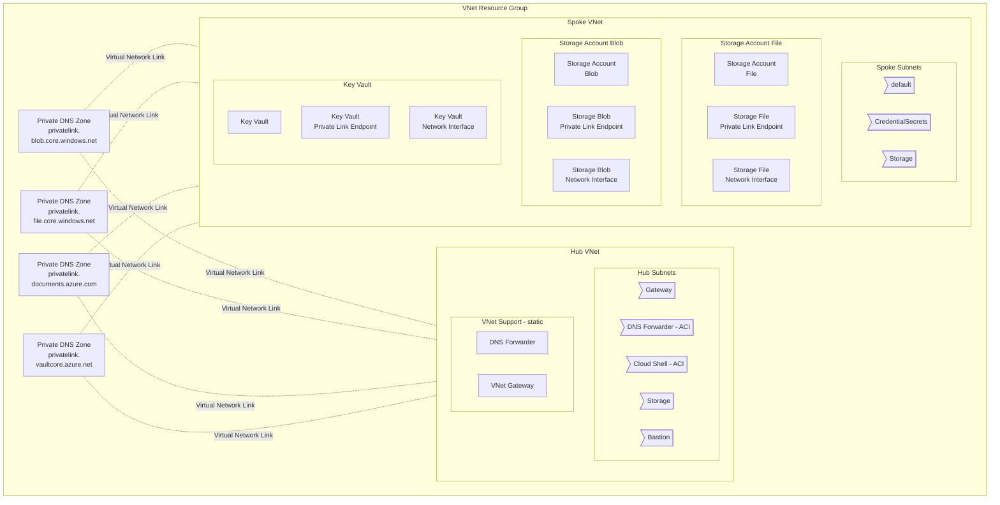
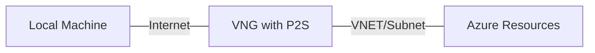

**The VPN gateway part is not yet functional**
## Purpose
Create a working Azure environment with
* Network with VNET
* Several Subnets
* Application Insights instancess with Log Analytics Workspace
* Storage Accounts with storage containers
* Linus VM with Log Analytics Workspace and Application Insights binding and agent
* RDP bastion server
* VPN endpoint

## Assumptions

Azure
* You have a default subscription set on the CLI
    * You logged in `az login`
    * Youi saw your available accounts `az account list`
    * You selected an account `az account set --subscription <subscription-id>`
    * You verified the current account `az account show`

Mac / BASH 
* You are runnign bash 4 or later.  Apple only ships version bash 3.x.  Install the latest bash with `homebrew bash install`

## Future / TODO
1. Linux VM drive storage should be private link only
1. Linux vm drive should be in storage resource groups
1. Log Analytics should have private storage scope
1. Add VNET attached cloud shell using cloud shell ACI subnet.  No obvious way to do that bound to a VNET with IaC
1. Cloudshell should use PLE for storage access.  IMO all storage should be accessed via PLE (JF)
1. Script the download the VPN package from the p2s blade in the VNG


## Scripts
| Script                       | Required for Bastion | Required for P2S VPN | Purpose |
| ---------------------------- | -------------------- | -------------------- | ------- |
| 0-install-tools.sh           | yes | yes | install AWS CLI and jq |
| 1-login-az.sh                | yes | yes | renew azure cli credentials if expired |
| 2-create-all-resources.sh    | yes | yes | create a resource group if it does not exist |
| 3a-create-all-vnet.sh        | yes | yes | Creates hub and spoke vnets, peerings, subnets, DNS forwarder in a container. Adds DNS to hub VNET |
| 4a-create-spoke-keyvault.sh  | no  | no  | Creates a Key Vault and Private Link Endpoints | 
| 5a-create-spoke-storage.sh   | no  | no  | Creates storage accounts, storage containers and Private Link Endpoints |
| 5b-create-spoke-cosmosdb.sh  | no  | no  | Create Cosmos DB instance and PLE connection.  No containers created |
| 6a-create-spoke-monitor.sh   | no  | no  | Creates Log Analytics Workspace and Application Insights instance |
| 6b-create-spoke- vm-linux.sh | no  | No  | Create a simple virtual machine on the default subnet with no public IP with a log analytics workspace | 
| 7a-create-hub-bastion.sh      | yes | no  | Creates a bastion host |
| 8a-create-hub-vng-with-p2s.sh | no  | yes | Creates a vng appliance with a P2S Address pool and self signed CA. Can VPN with the downloaded VPN Client config |
| 8b-create-hub-p2s.sh         | no  | yes | Creates and uploads the certificates using the Azure CLI. Can be used to add extra root certs. called by 8a-create-hub-vng-with-p2s |
| | | | | 
| 90-destroy-resource-group.sh           | n/a | n/a | Remove a resource group. May only works if public ips are disassociated or deleted |
| 91-purge-all-resource-groups.sh        | n/a | n/a | Remove everything in all resource groups leaving the resource groups |
| 92-purge-resource-groups-_resource_.sh | n/a | n/a | Remove everything in that Resource group |


The ARM templates are applied in `Incremental` mode so they can be used to update a configuration.
The purge scripts apply an ARM template in `Complete` mode.

The VNET gateway requires the resource groups and the vnet in order to be provisioned.

### Certificate installation.
Windows: Double click on the .pfx file and enter a passcode of `1234` to install the certificate in the windows certificate store.

### Troubleshooting
**--show-current invalid parameter**: Upgrade git.  

```
sudo add-apt-repository ppa:git-core/ppa
sudo apt update
sudo apt install git
```

Example: Before 2.17.1.  After 2.35.1

## Network IP Ranges
Pick network blocks that do not conflict with other networking. The network blocks below are non-routable (private) network blocks.
This project needs two private VNET ranges for the Azure components
1. Your VNET IP pool will be divided across several subnets
1. The Virtual Network Gateway address range managed by the network gateway

These network blocks are available for private VNETs. Typically we divide up the 10.x.x.x across multiple VNETS.
The each VNET divides its block among multiple subnets.

| block size | Full IP Range | Num IPs | Default mask | IP Bits | Network Bits | Network Class |
| ---------- | ------------- | ------- | ------------ | ------- | ------------ | ------------- |
| 24-bit     | 10.0.0.0 – 10.255.255.255   | 16777216 | 10.0.0.0/8 (255.0.0.0)       | 24  | 8   | single class A network |
| 20-bit     | 172.16.0.0 – 172.31.255.255 |  1048576 | 172.16.0.0/12 (255.240.0.0)  | 20  | 12  | 16 contiguous class B networks |
| 16-bit     | 192.168.0.0 – 192.168.255.255 |  65536 | 192.168.0.0/16 (255.255.0.0) | 16  | 16  |256 contiguous class C networks |


## VNET and Subnets
The VNet subnets are on the 10.x.x.x network.  We use two network ranges, one for the Hub VNet and one for the Spoke VNet.


```mermaid
flowchart TD
    VNetHub[Hub VNet<br/>10.0.0.0/20]
    VNetSpoke[Spoke VNet<br/>10.0.16.0/20]


    VNetHub --> SubHubVng[Gateway Subnet <br/>10.0.0.0/24  250]
    VNetHub --> SubHubDnsAci[DnsAci Subnet <br/>10.0.1.0/26 59]
    VNetHub --> SubHubAciShell[CloudShell Subnet <br/>10.0.1.64/26 59]
    VNetHub --> SubnetHubData[Storage Subnet <br/>10.0.1.192/26 59]
    VNetHub --> SubHubBast[AzureBastion Subnet <br/>10.0.1.128/26 59]

    VNetSpoke --> SubSpokeDef[default Subnet<br/>10.0.16.0/24 250]
    VNetSpoke --> SubSpokeData[Storage Subnet<br/>10.0.17.0/26 57]
    VNetSpoke --> SubSpokeCred[CredentialSecrets Subnet<br/>10.0.17.64/26 59]

    SubHubVng --> VNG[Virtual Network Gateway]
    VNG --> PubVNG[Public IP<br/>20.xx.xx.xx dynamic]
    VNG --> PoolVNG[Address Pool<br>172.16.0.0/26]

    SubHubDnsAci --> AciDns(DNS Forwarder<br/>Container)

    SubHubBast --> Bastion[Bastion Host]
    Bastion --> PubaAst[Public IP<br/>20.xx.xx.xx dynamic]

    SubSpokeDef --> NicVM[N.I.C.<br/>Linux]
    NicVM --> VM[Linux VM]

    StorAct[Storage Account]
    StorFile[Storage Account<br/>File]
    StorBlob[Storage Account<br/>Blob] 

    CosmosDB[Cosmos DB]

    
    SubSpokeData --> NicStorFile[N.I.C.<br/>File]
    NicStorFile --> PleFile[Private Endpoint<br/>Storage File]
    PleFile --> StorFile
    StorFile --> StorAct

    SubSpokeData --> NicStorBlob[N.I.C.<br/>Blob]
    NicStorBlob --> PleBlob[Private Endpoint<br/>Storage Blob]
    PleBlob --> StorBlob
    StorBlob --> StorAct

    SubSpokeData --> NicCosmos[N.I.C.<br/> Cosmos DB]
    NicCosmos --> PleCosmos[Private Endpoint<br/>Cosmos DB]
    PleCosmos --> CosmosDB

    SubSpokeCred --> NicKeyVault[N.I.C.<br/>Key Vault]
    NicKeyVault --> PleKV[Private Endpoint<br/>Key Vault]
    PleKV --> KeyVault[Key Vault]

    VNetHub --peer-.- VNetSpoke


```
Diagrams created with https://mermaid-js.github.io/mermaid/#/ - live editor at https://mermaid.live/

## DNS

The private DNS zones used to support the Private Link Endpoints (PLE) are managed via the same Resource Group that holds the `hub` and `spoke` VNets.  The private DNS zones are connected to the Hub and Spoke VNets via _Virtual Network links_ This essentially makes the names in those zones visible to the Hub and Spoke VNets.



### Private DNS Zones
Private DNS entrase are created for all Private Link Endpoint host names in the private DNS Zones.
The private DNS Zones are created in VNET Resource Group and are bound to `Hub` and `Spoke` VNETS via Virtual Network Links.

| Zone | Private Link Endpoints | Virtual Network Links |
| ---- | ------- | --------- |
| privatelink.blob.core.windows.net | Storage account blob store | Hub & Spoke |
| privatelink.file.core.windows.net | Storage account file store | Hub & Spoke |
| privatelink.documents.azure.com   | Cosmos DB                  | Hub & Spoke |
| privatelink.vaultcore.azure.net   | Key Vaults                 | Hub & Spoke |

Individual entries are added to DNS as the resources are created.  Eg: A Keyvault or A Blob store.

#### Troubleshooting SSL on Private Links.
You may get a certificate error connecting via the `privatelink` dns name. Use the base name instead.  That is what the certs are configured for.

Certificate Error when using privatelink
```
joe@z820:~/GitHub/vnet-p2s-vpn-bastion-azure$ curl  fsiexample0storage.privatelink.blob.core.windows.net
<?xml version="1.0" encoding="utf-8"?><Error><Code>AccountRequiresHttps</Code><Message>The account being accessed does not support http.
RequestId:013ec849-e01e-0060-75de-4aa201000000
Time:2022-04-08T00:24:19.8808433Z</Message><AccountName>fsiexample0storage</AccountName></Error>joe@z820:~/GitHub/vnet-p2s-vpn-bastion-azure$ curl  https://fsiexample0storage.privatelink.blob.core.windows.net
curl: (51) SSL: no alternative certificate subject name matches target host name 'fsiexample0storage.privatelink.blob.core.windows.net'
```
No Certificate Error when not using privatelink.xx.yy.zzz dns name

```
joe@z820:~/GitHub/vnet-p2s-vpn-bastion-azure$ curl  https://fsiexample0storage.blob.core.windows.net
<?xml version="1.0" encoding="utf-8"?><Error><Code>InvalidQueryParameterValue</Code><Message>Value for one of the query parameters specified in the request URI is invalid.
RequestId:b582ba33-c01e-007c-7fdf-4a7a16000000
Time:2022-04-08T00:26:03.7588962Z</Message><QueryParameterName>comp</QueryParameterName><QueryParameterValue /><Reason />
```

### Internal and External DNS
The project's Azure resources often have both internal and public IP addresses under the same names.  
Those resources are blocked from public internet access by firewalls and are only reachable across the VPN tunnel.
This means that programs need the internal IP addresses that can be resolved via DNS inside Azure.
The VNET has an associated DNS forwarder that is implemented as an Azure Container Instance. The project deploys this awesome project  https://github.com/whiteducksoftware/az-dns-forwarder 
This provides Azure internal IP addresses for private link resourcesto clients of the VPN tunnel.
You can find the reason for the need for the DNS forwarder in a bunch of places. See references below.

## Resource Groups
This example isolates related components components into their own Resource groups, Networking, Data Storage, etc.
Resource Group partitioning makes it easier to cleanly build and tear down ephemeral components while leaving core and persistence services running

| Resource Group | Description | Purge Script |
| - | - | - |
| Example-VNET-RG     | VNet and Subnets and VNG| 92-purge-resource-group-vnet.sh |
| Example-persist-RG  | Storage accounts, Cosmos and private link endpoints | 92-purge-resource-group-persist.sh |
| Example-bastion-RG  | Bastion host | 92-purge-resource-group-bastion.sh |
| Esample-secrets-RG  | Key Vaults | 92-purge-resource-group-keyvault.sh |
| Example-RG          | default resource group - compute, App Insights | 92-purge-resource-group-ephememeral |

A Virtual Network Gateway must be in the same Resource Group as the VNET itself.

## Accessing Storage Containers via Portal
The portal will **forbid you from browsing your Storage Containers** unless you add your home machine IP to the firewall approve list
1. Drill into your _storage account_ inthe portal
1. Click on `Networking`
1. Look at `Firewalls and virtual networks`
1. Click the checkbox next to _Add your client IP address_
1. Click on `Save`
1. Verify your ip is in the address range list

## Point to Site VPN
Most of the resources in this project are blocked from internet access.
We can access those resources using a Point-to-Site (P2s) VPN tunnel.



### Demonstrating just Point To Site VPN
The Point to Site only requires the resource groups, the vnet and the VNG.  
This means only need to run those three scripts to, 2,3,8, to get a working VPN connection.
The scripts will automatically create the certificates and upload them to Azure.
VPN configuration files are available for Windows and other platforms via the Gateway P2S blade.

### Windows VPN
1. Download the VPN configuration files from the portal.
1. Double click the generated `pfx` file in the _certs_ folder to load that certificate into your windows certificate store.

### Mac VPN
Mac computers expect IKEv2 connections. IKEv2 connections are not supported on the VPN gateway with the Basic SKU. 
* https://docs.microsoft.com/en-us/azure/vpn-gateway/vpn-gateway-vpn-faq
* https://docs.microsoft.com/en-us/answers/questions/762033/cant-connect-to-azure-vpn-from-macbook-pro.html
* https://docs.microsoft.com/en-us/azure/vpn-gateway/point-to-site-vpn-client-configuration-azure-cert
* https://docs.microsoft.com/en-us/azure/vpn-gateway/point-to-site-how-to-vpn-client-install-azure-cert

Open VPN integration for macs requires Azure AD configuration.
* https://docs.microsoft.com/en-us/azure/vpn-gateway/openvpn-azure-ad-client-mac


### Troubleshooting VPN DNS 
Internal IP address resolution for privatelink and other resources should be avaialble as soon as you connect via VPN.

Run an nslookup against your PLE endpoints. If they return external IPs then you are not using the VNET DNS server that we deployed as a container.
In that case it could be that your VPN tunnel (PPP) is a lower priority than your network connection.
In my case my ethernet connection was of a equivalent Metric which meant either public or private DNS could be used.

#### Problem Configuration
Resolves to external IPs when ethernet is connected because Ethernet Metric is same as VPN tunnel with lower index.
```
PS C:\Users\joe> netsh interface ipv4 show interfaces

Idx     Met         MTU          State                Name
---  ----------  ----------  ------------  ---------------------------
 60          25        1400  connected     FsiExample-VNET
  1          75  4294967295  connected     Loopback Pseudo-Interface 1
 23          70        1500  disconnected  Wi-Fi
  4          25        1500  connected     Ethernet
  5          25        1500  disconnected  Local Area Connection* 1
 12          65        1500  disconnected  Bluetooth Network Connection
 25          25        1500  disconnected  Local Area Connection* 2
 24          15        1500  connected     vEthernet (Default Switch)
 11          35        1500  connected     VMware Network Adapter VMnet1
 20          35        1500  connected     VMware Network Adapter VMnet8
 19          35        1500  connected     Azure Sphere
 56          15        1500  connected     vEthernet (WSL)

PS C:\Users\joe> nslookup   fsiexample0storage.blob.core.windows.net
Server:  Fios_Quantum_Gateway.fios-router.home
Address:  192.168.1.1

Non-authoritative answer:
Name:    blob.bn9prdstr05a.store.core.windows.net
Address:  52.239.174.132
Aliases:  fsiexample0storage.blob.core.windows.net
          fsiexample0storage.privatelink.blob.core.windows.net
```

#### Correct Configuration
Resolves to internal Azure IPs when ethernet disconnected because Wi-Fi is lower priority metric than the VPN tunnel.
```
PS C:\Users\joe> netsh interface ipv4 show interfaces

Idx     Met         MTU          State                Name
---  ----------  ----------  ------------  ---------------------------
 60          35        1400  connected     FsiExample-VNET
  1          75  4294967295  connected     Loopback Pseudo-Interface 1
 23          45        1500  connected     Wi-Fi
  4           5        1500  disconnected  Ethernet
  5          25        1500  disconnected  Local Area Connection* 1
 12          65        1500  disconnected  Bluetooth Network Connection
 25          25        1500  disconnected  Local Area Connection* 2
 24          15        1500  connected     vEthernet (Default Switch)
 11          35        1500  connected     VMware Network Adapter VMnet1
 20          35        1500  connected     VMware Network Adapter VMnet8
 19          35        1500  connected     Azure Sphere
 56          15        1500  connected     vEthernet (WSL)

PS C:\Users\joe> nslookup   fsiexample0storage.blob.core.windows.net
Server:  UnKnown
Address:  10.0.1.196

Non-authoritative answer:
Name:    fsiexample0storage.privatelink.blob.core.windows.net
Address:  10.0.1.4
Aliases:  fsiexample0storage.blob.core.windows.net
```

### Manually changing the Network Interface route mentric
You can change the metric of an interface to change the routing evaluation order. That command is

* Retrieve interface metrics `netsh int ip set interface interface="<interfae-name>" metric=<some-value>`
* Change the metric on an interface to be lower than Ethernet `netsh int ip set interface interface="FsiExample-hub-VNET" metric=15`

This shows a log of finding the problem, applying the fix and then verifying problem is solved.
```
PS C:\Users\joe> nslookup fsiexample0storage.privatelink.file.core.windows.net
DNS request timed out.
    timeout was 2 seconds.
Server:  UnKnown
Address:  2604:2d80:9a91:6100:26a0:74ff:fe73:bb47

Non-authoritative answer:
Name:    file.bn9prdstr11a.store.core.windows.net
Address:  20.60.88.43
Aliases:  fsiexample0storage.privatelink.file.core.windows.net

PS C:\Users\joe> netsh interface ipv4 show interfaces

Idx     Met         MTU          State                Name
---  ----------  ----------  ------------  ---------------------------
 53          25        1400  connected     FsiExample-hub-VNET
  1          75  4294967295  connected     Loopback Pseudo-Interface 1
 16          25        1500  connected     Ethernet
 37          15        1500  connected     vEthernet (Default Switch)
  6          35        1500  connected     VMware Network Adapter VMnet1
 25          35        1500  connected     VMware Network Adapter VMnet8
 48          15        1500  connected     vEthernet (WSL)

PS C:\Users\joe> netsh int ip set interface interface="FsiExample-hub-VNET" metric=15

PS C:\Users\joe> netsh interface ipv4 show interfaces

Idx     Met         MTU          State                Name
---  ----------  ----------  ------------  ---------------------------
 53          15        1400  connected     FsiExample-hub-VNET
  1          75  4294967295  connected     Loopback Pseudo-Interface 1
 16          25        1500  connected     Ethernet
 37          15        1500  connected     vEthernet (Default Switch)
  6          35        1500  connected     VMware Network Adapter VMnet1
 25          35        1500  connected     VMware Network Adapter VMnet8
 48          15        1500  connected     vEthernet (WSL)

PS C:\Users\joe> nslookup fsiexample0storage.privatelink.file.core.windows.net
DNS request timed out.
    timeout was 2 seconds.
Server:  UnKnown
Address:  10.0.1.4

DNS request timed out.
    timeout was 2 seconds.
Non-authoritative answer:
Name:    fsiexample0storage.privatelink.file.core.windows.net
Address:  10.0.17.4
```


## References
Incomplete list of resources used in creating this project.

ARM Templates
* https://docs.microsoft.com/en-us/azure/azure-resource-manager/templates/quickstart-create-templates-use-visual-studio-code?tabs=CLI
* https://github.com/Azure/azure-quickstart-templates/tree/master/quickstarts
* https://docs.microsoft.com/en-us/azure/templates/microsoft.storage/storageaccounts/blobservices/containers?tabs=bicep
* https://docs.microsoft.com/en-us/azure/azure-resource-manager/templates/variables
* https://docs.microsoft.com/en-us/azure/azure-resource-manager/templates/outputs
* https://docs.microsoft.com/en-us/azure/azure-resource-manager/templates/template-expressions
* https://docs.microsoft.com/en-us/azure/virtual-machines/tag-template

VNET / Subnet / Network
* https://docs.microsoft.com/en-us/azure/virtual-network/quick-create-cli
* https://en.wikipedia.org/wiki/Private_network
* https://dev.to/omiossec/azure-hub-and-spoke-topology-peering-and-arm-templates-5ej7

Azure Private Link and DNS
* https://docs.microsoft.com/en-us/azure/private-link/private-endpoint-dns

Public IP
* https://docs.microsoft.com/en-us/azure/virtual-network/virtual-network-public-ip-address
* https://docs.microsoft.com/en-us/azure/virtual-network/public-ip-addresses
* https://4sysops.com/archives/defining-a-public-ip-for-an-azure-resource-group-with-a-json-template/

Bastion Hosts
* https://docs.microsoft.com/en-us/azure/bastion/tutorial-create-host-portal

VPN gateway
* https://docs.microsoft.com/en-us/azure/vpn-gateway/vpn-gateway-about-vpngateways
* https://arminreiter.com/2017/06/connect-windows-10-clients-azure-vpn/
* https://www.starwindsoftware.com/blog/configuring-azure-point-to-site-vpn-with-windows-10
* https://docs.microsoft.com/en-us/azure/vpn-gateway/vpn-gateway-peering-gateway-transit
* https://docs.microsoft.com/en-us/azure/vpn-gateway/vpn-gateway-about-point-to-site-routing

P2S
* https://docs.microsoft.com/en-us/azure/storage/files/storage-files-configure-p2s-vpn-linux

Azure DNS over VPN Tunnels
* https://github.com/dmauser/PrivateLink/tree/master/DNS-Integration-P2S
* https://docs.microsoft.com/en-us/answers/questions/64223/issue-with-resolving-hostnames-while-connected-to.html

Azure Cloud Shell
* https://docs.microsoft.com/en-us/azure/cloud-shell/private-vnet
* https://docs.microsoft.com/en-us/azure/cloud-shell/persisting-shell-storage
* https://www.redeploy.com/posts/running-cloud-shell-from-your-virtual-network#:~:text=Azure%20Cloud%20Shell%20is%20a,day%20up%20in%20the%20cloud.
* https://github.com/Azure/CloudShell
* https://gist.github.com/larsakerlund/77d11a3e1dd990052cf9f48c3c328a84

VM Agents
* https://github.com/MicrosoftDocs/azure-docs/blob/master/articles/virtual-machines/extensions/oms-linux.md
* https://docs.microsoft.com/en-us/azure/virtual-machines/extensions/agent-dependency-linux
