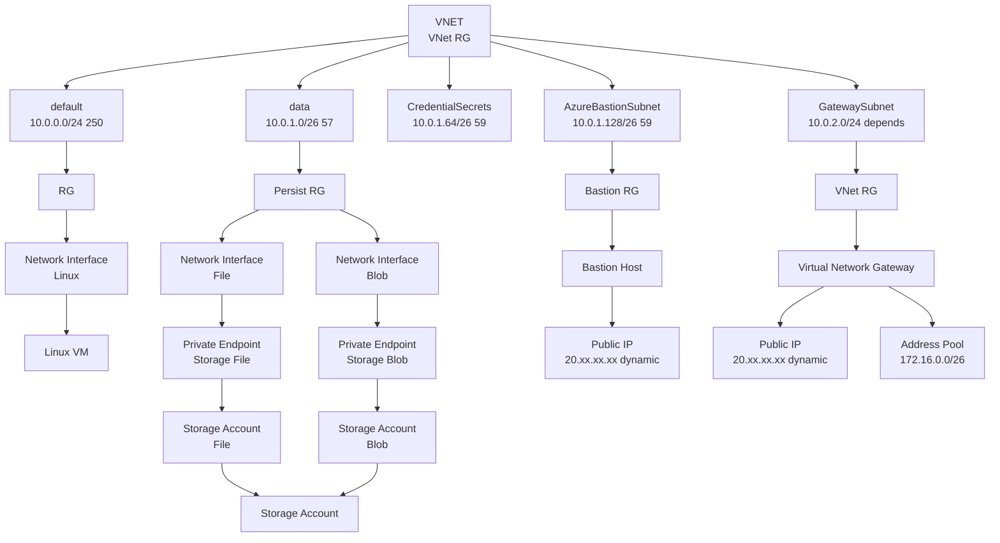

**The VPN gateway part is not yet functional**
## Purpose
Create a working Azure environment with
* Network with VNET
* Several Subnets
* Application Insights instancess with Log Analytics Workspace
* Storage Accounts with storage containers
* Linus VM with Log Analytics Workspace and Application Insights binding and agent
* RDP bastion server
* VPN endpoint

## Assumptions
* You have a default subscription set on the CLI
    * You logged in `az login`
    * Youi saw your available accounts `az account list`
    * You selected an account `az account set --subscription <subscription-id>`
    * You verified the current account `az account show`

## Future
1. Linux VM storage should be private link only
1. KeyVaults should be added. Must account for are soft deletable and hang around for 90 days.
1. Log Analytics should have private storage scope
1. Merge P2S certificate upload into template in 8-create-vpn.sh
1. Put Linux vm drive in storage resource groups
1. Download the VPN package from the p2s blade in the VNG

## Scripts
| Script                       | Required for Bastion | Required for P2S VPN | Purpose |
| ---------------------------- | -------------------- | -------------------- | ------- |
| 0-install-tools.sh           | yes | yes | install AWS CLI and jq |
| 1-login-az.sh                | yes | yes | renew azure cli credentials if expired |
| 2-create-resources.sh        | yes | yes | create a resource group if it does not exist |
| 3-create-vnet.sh             | yes | yes | Creates a vnet, subnets |
| 4-create-storage.sh          | opt | opt | Creates storage accounts, storage containers and Private Link Endpoints |
| 5-create-monitor.sh          | opt | opt | Creates Log Analytics Workspace and Application Insights instance |
| 6-create-vm-linux.sh         | yes | opt | Create a simple virtual machine on the default subnet with no public IP with a log analytics workspace | 
| 7-create-bastion.sh          | yes | no  | Creates a bastion host |
| 8-create-vng-with-p2s.sh     | no  | yes | Creates a vng appliance with a P2S Address pool and self signed CA. Can VPN with the downloaded VPN Client config |
| 9-create-p2s.sh              | no  | yes | Creates and uploads the certificates using the Azure CLI. Can be used to add extra root certs |
| | | | | 
| 90-destroy-resource-group.sh           | n/a | n/a | Remove a resource group. May only works if public ips are disassociated or deleted |
| 91-purge-all-resource-groups.sh        | n/a | n/a | Remove everything in all resource groups leaving the resource groups |
| 92-purge-resource-groups-_resource_.sh | n/a | n/a | Remove everything in that Resource group |

The ARM templates are applied in `Incremental` mode so they can be used to update a configuration.
The purge scripts apply an ARM template in `Complete` mode.

The VNET gateway requires the resource groups and the vnet in order to be provisioned.

## Selecting Network Ranges
Pick network blocks that do not conflict with other networking. The network blocks below are non-routable (private) network blocks.
1. Your VNET network
1. The Virtual Network Gateway address range

These are the candidate network ranges for private VNETs
| block size | Full IP Range | Num IPs | Default mask | IP Bits | Network Bits | Network Class |
| ---------- | ------------- | ------- | ------------ | ------- | ------------ | ------------- |
| 24-bit     | 10.0.0.0 – 10.255.255.255   | 16777216 | 10.0.0.0/8 (255.0.0.0)       | 24  | 8   | single class A network |
| 20-bit     | 172.16.0.0 – 172.31.255.255 |  1048576 | 172.16.0.0/12 (255.240.0.0)  | 20  | 12  | 16 contiguous class B networks |
| 16-bit     | 192.168.0.0 – 192.168.255.255 |  65536 | 192.168.0.0/16 (255.255.0.0) | 16  | 16  |256 contiguous class C networks |

## VNET and Subnets
Internal subnets are on the 10.x.x.x network

Diagrams created with https://mermaid-js.github.io/mermaid/#/

## Resource Groups
This example isolates related components components into their own Resource groups, Networking, Data Stores, etc.
Resource Group partitioning makes it easier to cleanly build and tear down ephemeral components while leaving core and persistence services running

| Resource Group | Description | Purge Script |
| - | - | - |
| Example-VNET-RG     | VNet and Subnets and VNG| 92-purge-resource-group-vnet.sh |
| Example-Persist-RG  | Storage accounts and private link endpoints | 92-purge-resource-group-persist.sh |
| Example-bastion-RG  | Bastion host | 92-purge-resource-group-bastion.sh |
| Example-RG          | default resource group - compute, App Insights | 92-purge-resource-group-ephememeral |

A Virtual Network Gateway must be in the same Resource Group as the VNET it is teh gatew for

## Accessing Storage Containers via Portal
The portal will **forbid you from browsing your Storage Containers** unless you add your home machine IP to the firewall approve list
1. Drill into your _storage account_ inthe portal
1. Click on `Networking`
1. Look at `Firewalls and virtual networks`
1. Click the checkbox next to _Add your client IP address_
1. Click on `Save`
1. Verify your ip is in the address range list

## Just Point To Site VPN
The Point to Site only requires the resource groups, the vnet and the VNG.  
This means only need to run those three scripts to, 2,3,8, to get a working VPN connection.
The scripts will automatically create the certificates and upload them to Azure.
You will have to download the VPN configuration files from the portal.

### Windows VPN
You will have to double click the pfx file in _certificates_ to load that certificate into your windows certificate store.

## References

ARM Templates
* https://docs.microsoft.com/en-us/azure/azure-resource-manager/templates/quickstart-create-templates-use-visual-studio-code?tabs=CLI
* https://github.com/Azure/azure-quickstart-templates/tree/master/quickstarts
* https://docs.microsoft.com/en-us/azure/templates/microsoft.storage/storageaccounts/blobservices/containers?tabs=bicep
* https://docs.microsoft.com/en-us/azure/azure-resource-manager/templates/variables
* https://docs.microsoft.com/en-us/azure/azure-resource-manager/templates/outputs
* https://docs.microsoft.com/en-us/azure/azure-resource-manager/templates/template-expressions
* https://docs.microsoft.com/en-us/azure/virtual-machines/tag-template

VNET / Subnet / Network
* https://docs.microsoft.com/en-us/azure/virtual-network/quick-create-cli
* https://en.wikipedia.org/wiki/Private_network

Public IP
* https://docs.microsoft.com/en-us/azure/virtual-network/virtual-network-public-ip-address
* https://docs.microsoft.com/en-us/azure/virtual-network/public-ip-addresses
* https://4sysops.com/archives/defining-a-public-ip-for-an-azure-resource-group-with-a-json-template/

Bastion Hosts
* https://docs.microsoft.com/en-us/azure/bastion/tutorial-create-host-portal

VPN gateway
* https://docs.microsoft.com/en-us/azure/vpn-gateway/vpn-gateway-about-vpngateways
* https://arminreiter.com/2017/06/connect-windows-10-clients-azure-vpn/
* https://www.starwindsoftware.com/blog/configuring-azure-point-to-site-vpn-with-windows-10

P2S
* https://docs.microsoft.com/en-us/azure/storage/files/storage-files-configure-p2s-vpn-linux

VM Agents
* https://github.com/MicrosoftDocs/azure-docs/blob/master/articles/virtual-machines/extensions/oms-linux.md
* https://docs.microsoft.com/en-us/azure/virtual-machines/extensions/agent-dependency-linux
